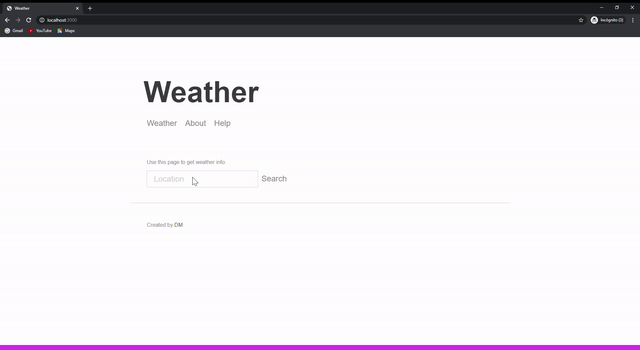

# Weather App

A weather forecasting app built on node.js (express.js).

## Installation
1. Clone or download the repository.
2. Install all the dependencies using the following command.
   ```bash
   npm install
   ```
3. Run the application using the following command.
   ```bash
   npm run start
   ```
4. Test the application using the following command.
   ```bash
   npm run test
   ```

## User Interface
#### How to use the app
- Type the city you are looking for
- Click search button
- The app show information about the location and forecast of the city



## APIs used
- [Dark Sky](https://darksky.net/dev)
- [mapbox](https://www.mapbox.com/)