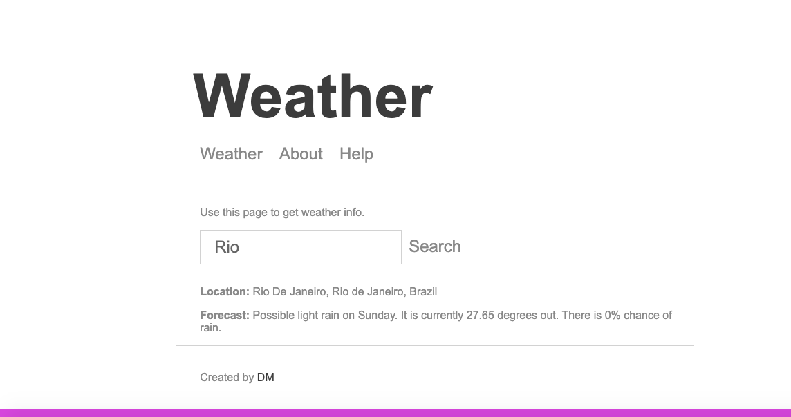

# Weather App

A weather forecasting app built on node.js (express.js).

## Installation
1. Clone or download the repository.
2. Install all the dependencies using the following command.
   ```bash
   npm install
   ```
3. Run the application using the following command.
   ```bash
   npm run start
   ```
4. Test the application using the following command.
   ```bash
   npm run test
   ```

## About this project 

The Weather App allows the user to find the current weather conditions of any area. It provides the user with the temperature, precipitation percentage and the forecast.

## Images 

Initial Page                  |  Searched Location
:-------------------------:|:-------------------------:
  |  
